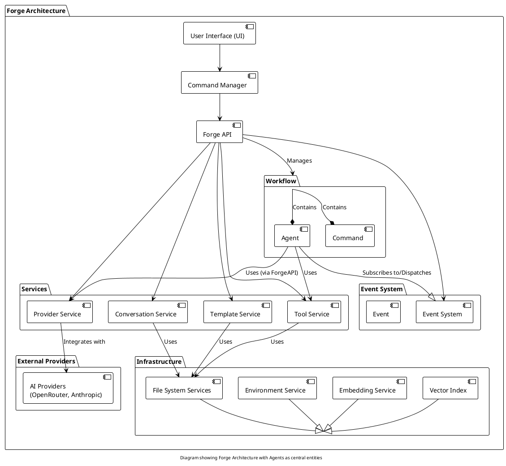

# Forge：架构分析报告

## 1. 执行摘要

Forge 是一个用于软件开发工作流的先进 AI 驱动的命令行应用程序。它采用多代理架构，具有专门针对不同任务的代理，模块化的面向服务的后端，以及灵活的工作流系统。该应用程序通过统一接口集成多个 AI 提供商，并支持各种开发工具，包括文件操作、Shell 命令和 GitHub 集成。Forge 旨在通过自动化重复任务、提供智能辅助以及简化软件开发流程来提高开发人员的生产力。

## 2. 系统概述

### 2.1 目的和范围

Forge 是一个为软件开发工作流设计的 AI 驱动的命令行应用程序。它采用多代理架构，具有专门针对不同任务的代理，模块化的面向服务的后端，以及灵活的工作流系统。该应用程序通过统一接口集成多个 AI 提供商，并支持各种开发工具，包括文件操作、Shell 命令和 GitHub 集成。Forge 旨在通过自动化重复任务、提供智能辅助以及简化软件开发流程来提高开发人员的生产力。

### 2.2 关键特性

- **多代理系统**：利用专门的代理执行不同角色（例如，软件工程师、帮助代理、GitHub 任务代理）。
- **工作流自动化**：支持为各种开发任务自定义工作流。
- **工具集成**：提供访问各种工具的能力，包括文件系统操作、Shell 执行和网络请求。
- **AI 提供商抽象**：通过统一 API 集成多个 AI 提供商（例如，OpenRouter、Anthropic）。
- **命令行界面**：提供用户友好的 CLI，用于与 AI 代理和工具交互。
- **基于模式的操作**：支持不同的操作模式（执行、计划、帮助）来控制代理的行为。
- **事件驱动架构**：使用事件进行代理和组件之间的通信和协调。
- **配置灵活性**：允许通过 YAML 配置文件自定义设置，并支持默认配置。

## 3. 核心架构

Forge 采用分层的、面向服务的架构，具有明确的关注点分离。核心层次为：

1.  **基础设施层（forge\_infra crate）**：提供基础服务，如文件系统访问、环境信息、向量嵌入和向量索引。
2.  **应用层（forge\_app crate）**：在基础设施层的基础上提供特定领域的服务，如工具管理、提供商管理、对话管理和模板渲染。
3.  **API 层（forge\_api crate）**：通过由 `ForgeAPI` 实现的明确定义的 API 特性，公开应用程序的功能。该层编排应用层中的服务。
4.  **提供商集成层（forge\_open\_router crate）**：处理与外部 AI 提供商（如 OpenRouter 和 Anthropic）的集成，提供 `ProviderService` 特性的具体实现。
5.  **主应用层（forge\_main crate）**：包含应用程序的入口点、命令行界面、UI 组件和命令处理逻辑。
6.  **领域层（forge\_domain crate）**：定义在整个应用程序中使用的核心领域模型、特性和数据结构。

为了进一步说明架构，特别是代理的核心角色，以下是组件图：



## 4. 组件分解

### 4.1 代理

Forge 使用多代理系统，其中专门的代理处理不同的任务。主要代理包括：

-   **软件工程师代理**：主要用于软件开发任务的代理，能够实现代码实现、文件操作和 Shell 执行。
-   **帮助代理**：为 Forge CLI 工具本身提供帮助和文档。
-   **GitHub 任务代理**：管理 GitHub 问题和拉取请求，自动化 GitHub 工作流。
-   **Git 提交工作者**：专门创建结构良好且信息丰富的 git 提交。
-   **GitHub 拉取请求工作者**：自动化拉取请求的创建和提交。
-   **标题生成工作者**：为任务和报告生成简洁且信息丰富的标题。

#### 4.1.1 代理定义和配置

代理是 Forge 架构中的核心概念，其定义分布在两个关键区域：

1.  **领域模型定义（`forge_domain` crate）**：
    `Agent` 的基本结构和属性在 `forge_domain` crate 中定义为领域模型。这个定义位于 `crates/forge_domain/src/agent.rs`，指定了所有代理共享的属性，例如：
    -   `id`：代理的唯一标识符。
    -   `model`：分配给代理的 AI 模型。
    -   `system_prompt`：定义代理角色和行为的指令。
    -   `user_prompt`：用户输入处理的模板。
    -   `tools`：代理可以使用的工具列表。
    -   `subscribe`：代理感兴趣的事件。
    -   ... 以及其他配置选项。

    这个领域模型为在 Forge 系统中创建和管理代理提供了蓝图。

2.  **工作流配置（`forge.default.yaml` 文件和自定义工作流）**：
    具体的代理实例及其具体配置在工作流配置文件中定义。默认工作流配置 `forge.default.yaml` 作为主要示例。以下是来自 `forge.default.yaml` 的 "software-engineer" 代理配置片段：

    ```yaml
    - tool_supported: true
      id: software-engineer
      model: *advanced_model
      system_prompt: "{{> system-prompt-engineer.hbs }}"
      user_prompt: |-
        <task>{{event.value}}</task>
        <mode>{{variables.mode}}</mode>
      ephemeral: false
      tools:
        - tool_forge_fs_read
        - tool_forge_fs_create
        - tool_forge_fs_remove
        - tool_forge_fs_patch
        - tool_forge_process_shell
        - tool_forge_net_fetch
        - tool_forge_fs_search
      subscribe:
        - user_task_init
        - user_task_update
      max_walker_depth: 4
    ```

    这个 YAML 配置实例化了一个 "software-engineer" 代理，为其分配 `id`，链接到模型（`*advanced_model`），使用 Handlebars 模板指定其 `system_prompt`，定义它可以访问的 `tools`，并设置其他属性。自定义工作流可以定义额外的代理或修改现有代理的配置，允许灵活和定制化的代理设置。

### 4.2 服务

Forge 采用面向服务的架构，具有各种专门的服务：

-   **提供商服务（forge\_api, forge\_open\_router crates）**：通过 `ProviderService` 特性抽象，由 `OpenRouter` 和 `Anthropic` 客户端实现。处理与 AI 模型提供商的通信。
-   **工具服务（forge\_app crate）**：管理和执行工具，为代理提供与外部系统交互的接口。
-   **对话服务（forge\_app crate）**：管理对话状态、历史和上下文，实现持久和上下文相关的交互。
-   **模板服务（forge\_app crate）**：使用 Handlebars 模板渲染提示，允许动态和上下文感知的提示生成。
-   **文件系统服务（forge\_infra crate）**：为文件系统操作（读取、写入、删除、元数据、快照、创建目录）提供抽象，实现平台无关的文件处理。
-   **环境服务（forge\_infra crate）**：提供对系统环境信息的访问，如操作系统、Shell 和目录。
-   **嵌入服务（forge\_infra crate）**：使用 OpenAI 的嵌入 API 创建文本的向量嵌入，实现语义搜索和相似性比较。
-   **向量索引（forge\_infra crate）**：使用 Qdrant 实现，提供用于存储和搜索向量嵌入的向量数据库。
-   **加载器服务（forge\_api crate）**：从 YAML 文件或嵌入的默认设置加载工作流配置。
-   **执行器服务（forge\_api crate）**：执行聊天请求并管理与 AI 提供商的交互。
-   **建议服务（forge\_api crate）**：基于当前上下文提供文件路径和命令的建议。

### 4.3 工作流

工作流是 Forge 架构的核心，定义应用程序的行为并编排代理交互。工作流使用 YAML 文件配置，由以下部分组成：

-   **代理**：参与工作流的专门代理集合。
-   **变量**：工作流级别的变量，用于在代理之间存储和共享状态。
-   **命令**：可以在工作流中执行的自定义命令。

工作流由 `ForgeLoaderService` 加载并由 `ForgeAPI` 管理。默认工作流提供了一个基线配置，可以通过项目特定的配置进行自定义或覆盖。

### 4.4 命令处理

Forge 使用基于命令的接口，用户输入被解析并作为命令处理。`ForgeCommandManager` 处理命令注册、解析和执行。命令可以是：

-   **系统命令**：内置命令，如 `/new`、`/info`、`/exit`、`/models`、`/dump`、`/act`、`/plan`、`/help`。
-   **自定义命令**：在工作流配置中定义的命令，以 `/` 为前缀。
-   **消息**：作为消息发送给 AI 代理的常规文本输入。

`Command` 枚举表示不同的命令类型，`UserInput` 特性定义了如何从不同来源（例如，控制台、文件）处理用户输入。

### 4.5 事件系统

Forge 采用事件驱动架构进行代理和组件之间的通信和协调。事件由 `Event` 模型表示，具有名称、值和时间戳。代理可以订阅特定事件并将事件作为工具调用分派。关键事件包括：

-   `user_task_init`：表示用户任务的开始。
-   `user_task_update`：表示用户任务的更新。
-   `user_help_query`：表示用户帮助查询。
-   `title`：用于设置对话标题。
-   `commit`：表示提交操作。
-   `pull-request`：表示拉取请求操作。
-   `fix_issue`：表示 GitHub 问题修复任务。
-   `update_pr`：表示 GitHub 拉取请求更新任务。

## 5. 工作流模式

Forge 使用几个关键的工作流模式：

-   **多代理协作**：任务被分解并分配给专门的代理，每个代理都有特定的专业知识和责任。
-   **事件驱动编排**：使用事件触发代理操作并协调工作流执行。
-   **基于模式的操作**：应用程序在不同模式下运行（执行、计划、帮助），根据用户意图控制代理的行为和能力。
-   **配置分层**：工作流配置分层，允许项目特定的配置覆盖默认设置。
-   **基于工具的操作**：代理通过明确定义的工具系统与环境交互并执行操作。

## 6. 集成点

Forge 与多个外部系统和服务集成：

-   **AI 提供商（OpenRouter、Anthropic）**：利用外部 AI 模型进行自然语言处理和代码生成。
-   **GitHub CLI (gh)**：与 GitHub 集成，用于问题和拉取请求管理，实现自动化的 GitHub 工作流。
-   **Qdrant 向量数据库**：使用 Qdrant 存储和搜索向量嵌入，实现语义搜索和建议功能。
-   **OpenAI 嵌入 API**：利用 OpenAI 的嵌入 API 创建文本的向量嵌入。
-   **Handlebars 模板引擎**：使用 Handlebars 进行动态提示生成和模板渲染。

## 7. 设计模式

Forge 使用多种设计模式来实现其架构和功能：

-   **面向服务架构（SOA）**：应用程序被结构化为松散耦合的服务集合，每个服务负责特定功能。
-   **工厂模式**：`builder.rs` 中的 `Client::new` 方法充当创建特定提供商客户端的工厂。
-   **策略模式**：`ProviderService` 特性及其实现（`OpenRouter`、`Anthropic`）体现了策略模式，允许可互换的提供商实现。
-   **适配器模式**：`response.rs` 中的 `OpenRouterResponse` 和 `Choice` 结构充当适配器，将特定提供商的响应格式转换为应用程序的领域模型。
-   **装饰器模式**：`app.rs` 中的 `ForgeApp` 结构充当装饰器，包装基础设施并在其上添加特定于应用的服务。
-   **事件驱动架构（EDA）**：应用程序使用事件进行组件之间的通信和协调，实现松散耦合和异步处理。

## 8. 结论

Forge 为 AI 驱动的软件开发命令行应用程序呈现了精心设计且复杂的架构。其模块化设计、多代理系统、面向服务的后端和灵活的工作流引擎使其能够有效地自动化和增强各种软件开发任务。明确的关注点分离、使用已建立的设计模式以及与外部服务的全面集成，共同为 AI 辅助软件工程提供了一个健壮且可扩展的平台。